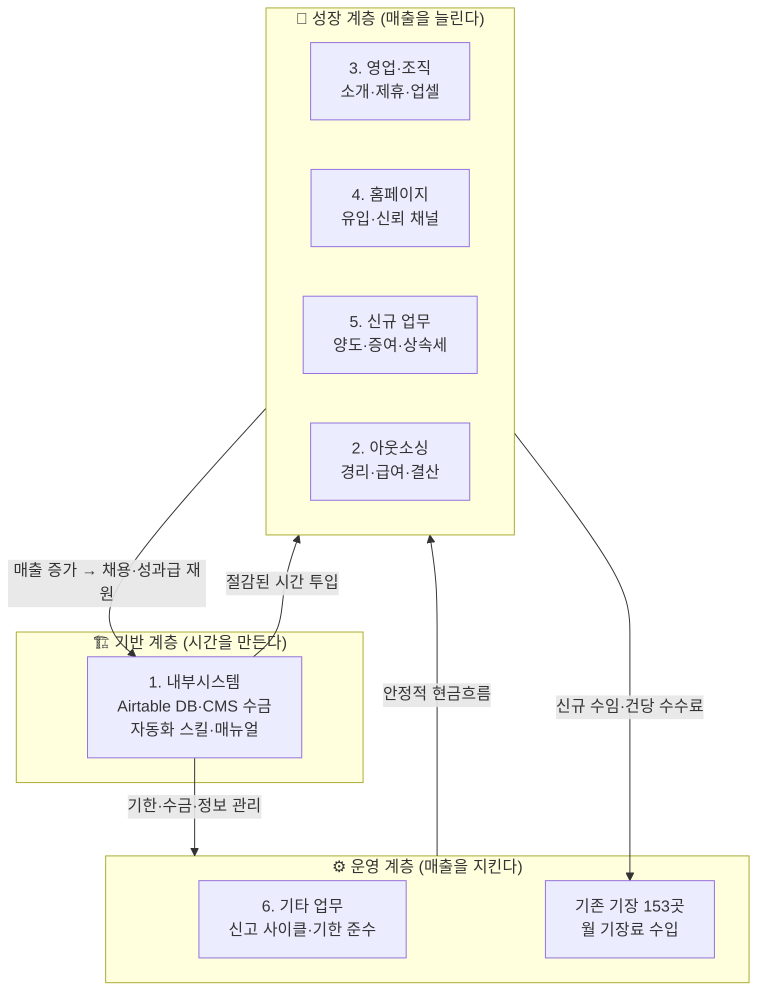
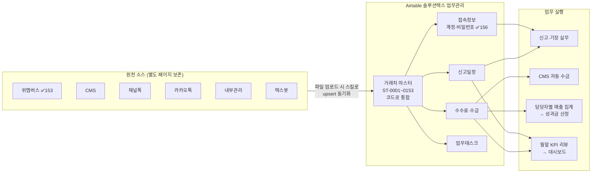
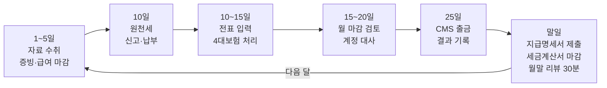
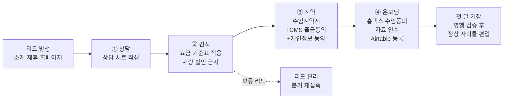
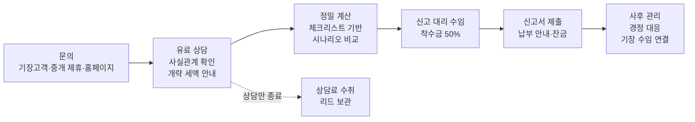
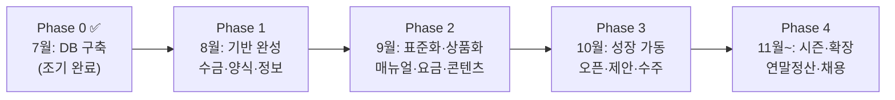
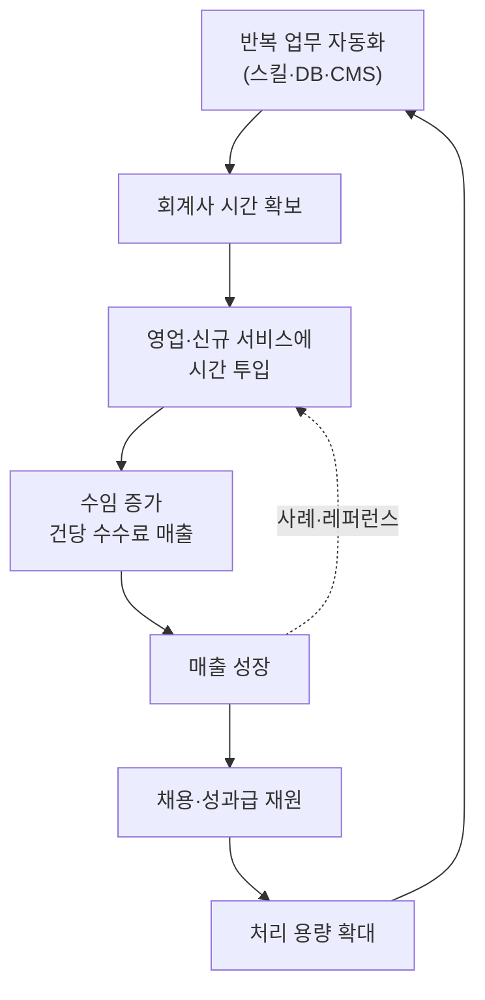

# 솔루션택스 실행 전략 — 구조도·절차·단계별 액션플랜

> 2026-07-21 기준 · [업무 플랜 문서 세트](./README.md)의 실행 전략 편
> 핵심 논리: **자동화로 시간을 벌고 → 그 시간으로 성장 엔진(영업·신규 서비스)을 돌리고 → 늘어난 매출로 조직을 만든다**

---

## 1. 사업 구조도 — 6개 축이 맞물리는 방식

세 계층으로 본다. 기반이 튼튼해야 성장 축이 돌아가고, 성장의 결실이 다시 기반에 재투자된다.

**전략적 함의**
- 8월에 기반(1번 축)을 먼저 완성하는 이유: 이후 모든 축이 이 위에서 돌아간다. *(Airtable 구축은 7/21 조기 완료됨)*
- 아웃소싱(2)은 성장 축이면서 이미 운영 중(YMK) — 가장 빨리 매출화 가능한 축이므로 9월에 상품화한다.
- 홈페이지(4)는 단독 목표가 아니라 영업(3)·신규 업무(5)의 **수주 창구**다. 콘텐츠도 서비스 소개가 중심.

## 2. 시스템·데이터 구조도 — 정보가 흐르는 길

**운영 원칙**
- **소스는 보존, 마스터가 기준**: 소스 테이블은 원본 그대로, 판단·업무는 항상 마스터(거래처코드) 기준
- **재업로드 = 동기화**: 위멤버스 파일은 `wemembers-sync` 스킬로 자동 upsert (신규 코드 부여·변경 반영·해지 후보 감지). 다른 소스도 같은 패턴으로 확장
- **문서와 데이터의 분리**: 데이터는 Airtable, 매뉴얼·플랜·스킬은 docs 저장소(git)

## 3. 핵심 절차 플로우

### 3-1. 월간 운영 사이클 (모든 달의 뼈대)

- 독촉 규칙: 5일 1차 요청 → 10일 2차(마감 영향 안내) → 15일 유선
- 구축성 작업(시스템·영업·홈페이지)은 **10일 이후~월말 전** 구간에만 배치

### 3-2. 신규 수임 프로세스 (영업 → 온보딩)

- 각 단계 양식(상담 시트·요금표·계약서·온보딩 체크리스트)은 8월에 `templates/`로 완성 → 이후 누가 해도 같은 품질
- 온보딩 완료 조건: Airtable 거래처코드 부여 + 접속정보 등록 + 신고일정 등록 3종 세트

### 3-3. 재산제세 서비스 플로우 (신규 업무)

- 기한 관리: 수임 즉시 Airtable 신고일정 등록 (양도 2개월 / 증여 3개월 / 상속 6개월 — 속한 달 말일 기산)
- 전략 포인트: 기장 고객 153곳의 **대표자 개인 자산 이슈**가 1차 시장 — 대표자정보 DB(156명)가 이미 있음

## 4. 단계별 실행 전략 (Phase)

| Phase | 기간 | 목표 (한 문장) | 핵심 액션 | 완료 기준 (DoD) |
|---|---|---|---|---|
| **0. DB 구축** ✅ | 7월 | 거래처 데이터를 한곳에 모은다 | Airtable 5+7테이블, 153곳 입력, 동기화 스킬 | ✅ 마스터 153·접속정보 156·스킬 커밋 |
| **1. 기반 완성** | 8월 | 수금과 정보 관리가 자동으로 돈다 | CMS 계약·동의 수취, 인증서 만료일 전수 입력, 수임 양식 4종, 중간예납 처리 | CMS 첫 출금 준비 완료 · 양식으로 신규 상담 1건 처리 가능 · 8/31 중간예납 전건 완료 |
| **2. 표준화·상품화** | 9월 | 팔 수 있는 상품과 시스템이 갖춰진다 | 월 마감 매뉴얼, 아웃소싱 요금표·계약서, 양도세 계산 시트, 홈페이지 원고, 기본급 조사 | 매뉴얼만 보고 제3자가 월 마감 가능 · 아웃소싱 견적 즉시 산출 가능 · 9/25 CMS 첫 출금 성공 |
| **3. 성장 가동** | 10월 | 성장 채널이 실제로 열린다 | 홈페이지 오픈, 아웃소싱 업셀 제안, 재산제세 상담 접수 개시, 성과급 산식 확정, 부가세 예정 | 홈페이지 경유 문의 동선 작동 · 업셀 제안 5건 발송 · 10/26 부가세 전건 완료 |
| **4. 시즌·확장** | 11월~ | 성수기를 조직으로 받아낸다 | 연말정산 준비, 종소세 중간예납(11/30), 채용 판단·공고, 11~1월 플랜 수립 | 연말정산 대상 집계 완료 · 채용 여부 의사결정 완료 |

## 5. 성장 플라이휠 — 이 전략이 돌아가는 원리

병목이 항상 **회계사의 시간**이므로, 매 Phase에서 "이번 달 자동화·표준화로 몇 시간을 벌었고 어디에 썼는가"를 월말 리뷰에서 확인한다.

## 6. KPI — 월말 리뷰 30분에 보는 숫자

| KPI | 현재 (7월) | 10월 목표 | 데이터 원천 |
|---|---|---|---|
| 수임 거래처 수 | 153 | 160+ | Airtable 마스터 |
| 월 기장료 합계 | 입력 완료 (마스터 집계) | +10% | 마스터 월 기장료 필드 |
| CMS 수금률 | — (미도입) | 90%+ | 수수료·수금 테이블 |
| 미수금 | — | 2개월 초과 0건 | 수수료·수금 테이블 |
| 신규 상담 건수 | — | 월 5건 | 업무태스크/상담 시트 |
| 재산제세 상담 | — | 월 2건 | 신고일정(양도·증여·상속) |
| 신고기한 준수 | 100% 유지 | 100% | 신고일정 완료율 |
| 플랜 태스크 진행률 | 9% (3/32) | 90%+ | dashboard.html |

## 7. 리스크와 대응

| 리스크 | 징후 | 대응 |
|---|---|---|
| 신고 시즌에 구축 작업 정체 | 체크박스 2주 연속 정지 | 월말 리뷰에서 다음 달 태스크 절반으로 감축 (포기 대신 축소) |
| CMS 동의 수취 저조 | 8월 말 동의율 50% 미만 | 9월분은 기존 방식 병행, 미동의 고객 유선 안내 |
| 홈페이지 지연 | 9월 말 원고 미완 | 오픈 범위 축소 (서비스 소개+상담 채널만 먼저) |
| 아웃소싱 업셀 무반응 | 제안 5건 중 0건 회신 | 요금·범위 재설계 후 12월 재시도, YMK 사례서 보강 |
| 직원 채용 전 업무 과부하 | 월 마감 상시 지연 | 채용 앞당김 + 신규 수임 일시 조절 |

---

*갱신 규칙: Phase 전환 시점(월말 리뷰)에 이 문서의 DoD 달성 여부를 체크하고, 미달 항목은 다음 Phase로 명시적으로 이월한다.*
